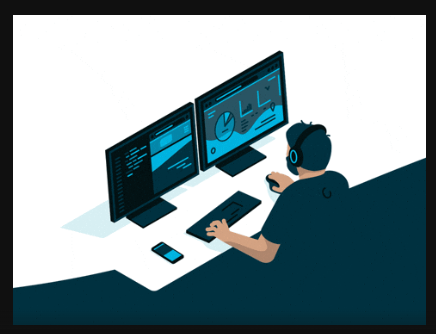
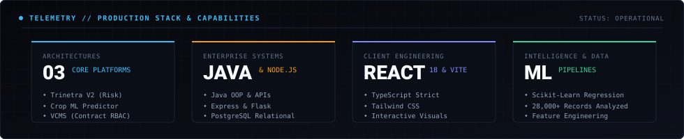

<div align="center">

<!-- ================================================================= -->
<!--         EXECUTIVE MNC SOFTWARE ENGINEER & SYSTEMS HERO            -->
<!-- ================================================================= -->



<br><br>

> *"Architecting mission-critical distributed backends, modern reactive interfaces, and applied machine learning pipelines through the lens of engineering discipline and structural precision."*

<p align="center">
  
  &nbsp;
  
  &nbsp;
  
</p>

</div>

---

<!-- ================================================================= -->
<!--          ENGINEERING CODEX & WORKSPACE TELEMETRY                  -->
<!-- ================================================================= -->

<table>
<tr>
<td width="57%" valign="top">

### ⚡ Architectural Codex

I build software with high technical standards, scalable architectural patterns, and production-grade resilience. From enterprise backend services and relational data modeling to predictive regression pipelines and fluid web interfaces, every system is engineered for scale, reliability, and real-world utility.

```typescript
class SeniorTechnologist {
  readonly identity = "Preyansh Bhagatwala";
  readonly roles = [
    "Software Engineer",
    "Full Stack Developer",
    "AI/ML Enthusiast"
  ];

  readonly engineeringStack = {
    enterpriseBackend: ["Java", "Python", "Node.js", "Express", "Flask"],
    databaseSystems:   ["PostgreSQL", "Relational Schemas", "Indexing"],
    modernFrontend:    ["React 18", "Vite", "TypeScript", "Tailwind CSS"],
    appliedAI:         ["Scikit-Learn", "Predictive Regressors", "NumPy", "Pandas"]
  };

  readonly principle = "Scalable architectural durability on the backend; effortless precision on the client.";
}
```

</td>
<td width="43%" align="center" valign="middle">



<br>
<sub><b>COMMAND CENTER // WORKSTATION TELEMETRY</b></sub>

</td>
</tr>
</table>

---

## 🛠️ Technical Arsenal

<div align="center">

### ☕ Enterprise Backend & Distributed Systems
<p align="center">
  
</p>
<p>
  <code>Java (OOP &amp; Core Systems)</code> • <code>Python</code> • <code>Node.js</code> • <code>Express.js</code> • <code>Flask</code> • <code>PostgreSQL</code> • <code>RESTful APIs</code>
</p>

### ⚛️ Modern Frontend & Client Architecture
<p align="center">
  
</p>
<p>
  <code>React 18</code> • <code>TypeScript</code> • <code>JavaScript</code> • <code>Vite</code> • <code>Tailwind CSS</code> • <code>Responsive Architecture</code> • <code>Component Systems</code>
</p>

### 🧠 Applied Machine Learning & Data Intelligence
<p align="center">
  
</p>
<p>
  <code>Scikit-Learn</code> • <code>Random Forest Regressors</code> • <code>Pandas</code> • <code>NumPy</code> • <code>Feature Pipelines</code> • <code>Model Cross-Validation</code>
</p>

### 🚀 DevOps, Cloud & Tooling
<p align="center">
  
</p>
<p>
  <code>Git</code> • <code>GitHub</code> • <code>Postman</code> • <code>Vercel</code> • <code>Bash / Linux</code> • <code>npm</code> • <code>Production Builds</code>
</p>

</div>

---

## 🏛️ Flagship Engineering Systems

```
========================================================================================
  PRODUCTION CODEBASES: SCALED ARCHITECTURES & APPLIED MACHINE LEARNING
========================================================================================
```

### 🛡️ **01 / TRINETRA V2** — *Parametric Climate Risk & Automated Micro-Insurance Engine*
> **Automated parametric income protection safeguarding Indian gig delivery workers from extreme weather disruption.**

* **Architectural Highlights**:
  - Ingests real-time meteorological telemetry and environmental thresholds to detect acute climate disruptions.
  - Implements algorithmic parametric claim triggers that calculate compensation without manual insurance bureaucracy.
  - Built with secure transaction ledgers and financial resilience logic for rapid micro-payout execution.
* **Core Stack**: `JavaScript` • `Parametric Risk Logic` • `Weather Telemetry APIs` • `FinTech Cloud`  
* 🔗 **[Explore TrinetraV2 Repository →](https://github.com/preyanshbhagatwala-web/TrinetraV2)**

---

### 🌾 **02 / CROP YIELD PREDICTOR** — *End-to-End ML Harvest Analytics Platform*
> **Multi-variable agricultural yield forecasting system analyzing 28,000+ historical records across 100+ countries.**

* **Architectural Highlights**:
  - Trained an optimized Random Forest Regressor pipeline with cross-validated parameter tuning.
  - Synthesizes real-time interaction features (`rainfall × temperature`, `pesticide-to-rainfall ratio`).
  - High-throughput Flask REST API backend paired with an interactive React 18 & Vite client dashboard.
* **Core Stack**: `Python` • `Scikit-Learn` • `Flask REST API` • `React 18` • `Vite` • `Recharts`  
* 🔗 **[Explore crop-yield-predictor Repository →](https://github.com/preyanshbhagatwala-web/crop-yield-predictor)**

---

### 🏢 **03 / VCMS** — *Enterprise Vendor & Contract Management System*
> **Mission-critical governance platform featuring 6-tier RBAC, document repositories, and audit ledgers.**

* **Architectural Highlights**:
  - Relational PostgreSQL database schema with UUID primary keys, connection pooling, and relational integrity.
  - Granular 6-role RBAC security middleware (`admin`, `manager`, `legal`, `finance`, `auditor`, `viewer`).
  - Multipart document attachment pipeline with Multer and complete chronological audit logging.
* **Core Stack**: `Java / Node.js` • `Express.js` • `PostgreSQL` • `JWT & bcrypt` • `Chart.js` • `Multer`  
* 🔗 **[Explore VCMS Repository →](https://github.com/preyanshbhagatwala-web/VCMS)**

---

## 📊 System Telemetry & Capabilities

<div align="center">



</div>

---

## 🌐 Connect & Collaborate

<div align="center">

Open to exploring high-impact software engineering roles, full-stack platform architectures, and cutting-edge machine learning collaborations:

<br>

<a href="mailto:preyanshbhagatwala@gmail.com">
  
</a>
&nbsp;&nbsp;
<a href="https://github.com/preyanshbhagatwala-web">
  
</a>

<br><br>

```text
// Engineered with architectural discipline, technical precision, and clean code.
```

</div>
